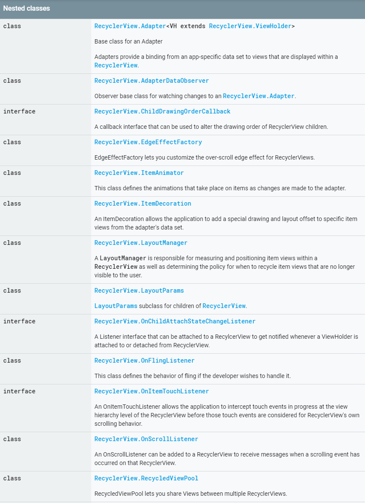
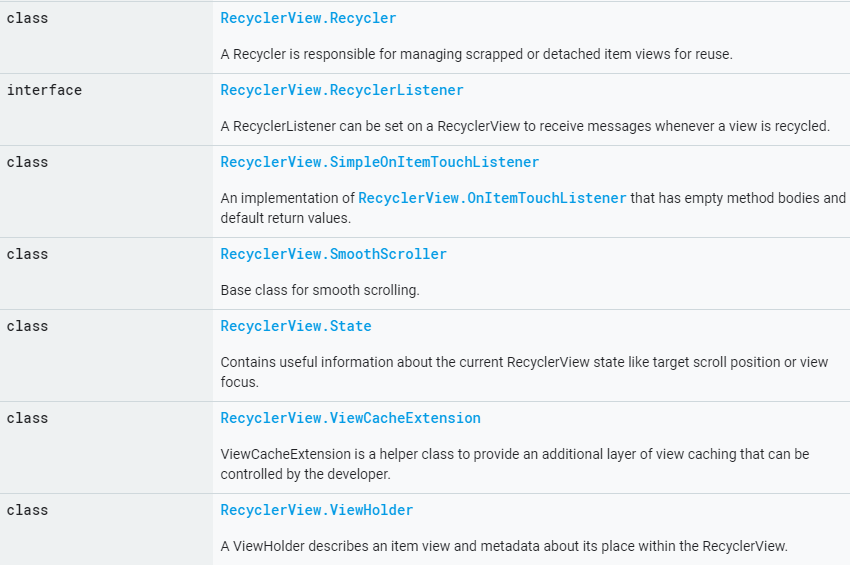

# RecyclerView
## Positions in RecyclerView 
   RecyclerView在RecyclerView.Adapter和RecyclerView.LayoutManager之间引入了另一种抽象级别，以便能够在布局计算期间批量检测数据集变化。 这样可以避免LayoutManager跟踪适配器变化来计算动画。 这也有助于提高性能，因为所有视图绑定同时发生，并且避免了不必要的绑定。
    因此， RecyclerView中有两种位置：
		layout Position：item在最新布局里的位置
		adapter Position： item在adapter的位置
    除了在调度adapter.notify* 方法到计算最新布局的这段时间，这两个位置没有区别。
    返回或者接收“LayoutPosition”的方法使用最新布局位置（如RecyclerView.ViewHolder.getLayoutPosition(), findViewHolderForLayoutPosition(int)），这些位置包括直到最后一次布局计算的所有变化。 您可以依靠这些位置来与用户当前在屏幕上看到的内容保持一致。 例如，如果您在屏幕上有一个项目列表，并且用户要求输入第5个元素，则应使用这些方法，因为它们将与用户看到的内容相匹配。
	另一组与位置相关的方法采用* AdapterPosition * 的形式。 （例如RecyclerView.ViewHolder.getAdapterPosition（），findViewHolderForAdapterPosition（int）），当您需要使用最新的适配器位置时，即使它们可能尚未反映到布局中，也应使用这些方法。 例如，如果要通过单击ViewHolder来访问适配器中的项目，则应使用RecyclerView.ViewHolder.getAdapterPosition（）。 请注意，如果已调用RecyclerView.Adapter.notifyDataSetChanged（）并且尚未计算新的布局，则这些方法可能无法计算适配器的位置。 因此，您应该仔细处理这些方法的NO_POSITION或空结果。
      **总结：总的来说，大多数情况下用 getAdapterPosition，只要不用 notifyDataSetChanged() 来刷新数据就总能立即获取到正确 position 值。什么情况下用 getLayoutPosition 呢？就是调用 findViewHolderForLayoutPosition 获取当前点击的 Item 的 ViewHolder 时，因为此时 layout position 和用户在屏幕上看到的一定是一样的。

## 动态数据展示
要在RecyclerView中显示可更新的数据，您的适配器需要向RecyclerView发出插入、移动和删除的信号。 您可以通过在内容更改时手动调用adapter.notify* 方法来自己构建此文件，也可以使用RecyclerView提供的更简单的解决方案之一：

### List diffing with DiffUtil  

 如果您的RecyclerView显示的列表每次更新都从头开始重新获取的列表（例如从网络或数据库），则DiffUtil可以计算出列表版本之间的差异。 DiffUtil将两个列表都作为输入并计算差异，可以将差异传递给RecyclerView以触发最少的动画和更新以保持UI性能以及动画有意义。 这种方法要求每个列表都以不可变的内容表示在内存中，并且依赖于接收更新作为列表的新实例。 如果您的UI层不执行排序，而是仅按给定的顺序显示数据，则此方法也是理想的选择。
 		这种方法最好的部分是它可以扩展到任意更改----item更新、移动、添加和删除都可以以相同的方式计算和处理。 尽管在进行差异时确实必须将列表的两个副本保留在内存中，并且必须避免对其进行突变，但是可以在列表版本之间共享未修改的元素。
		有三种实现方法：
		[ListAdapter](https://developer.android.com/reference/androidx/recyclerview/widget/ListAdapter.html)
		[AsyncListDiffer](https://developer.android.com/reference/androidx/recyclerview/widget/AsyncListDiffer.html)
		[DiffUtil](https://developer.android.com/reference/androidx/recyclerview/widget/DiffUtil.html)
 ### List mutation with SortedList
 ### paging library

## summary

# RecyclerView.Adapter
## Summary

## Public Methods
### notifyDataSetChanged 
通知所有已注册的观察者，该数据集已改变。
有两种数据变化：item change 和 structural change。item change是指数据更新，但是位置没有变化。structural change是指数据发生插入、删除、移动等操作。
该方法并没有指定数据集发生何种变化，强制所有观察者假定目前所有数据均失效，需要重新绑定以及布局。
尽量使用更具体的方法，这样会更有效。万不得已，可以采用该方法。
更有效的和更具体的方法，参考：
notifyItemChanged(int)
notifyItemInserted(int)
notifyItemRemoved(int)
notifyItemRangeChanged(int, int)
notifyItemRangeInserted(int, int)
notifyItemRangeRemoved(int, int)

**注意：这些具体的刷新方法会造成屏幕闪以下** 

### 参考：
[Developer介绍](https://developer.android.com/reference/androidx/recyclerview/widget/RecyclerView)