# RecyclerView
## Positions in RecyclerView 
   RecyclerView在RecyclerView.Adapter和RecyclerView.LayoutManager之间引入了另一种抽象级别，以便能够在布局计算期间批量检测数据集变化。 这样可以避免LayoutManager跟踪适配器变化来计算动画。 这也有助于提高性能，因为所有视图绑定同时发生，并且避免了不必要的绑定。

因此， RecyclerView中有两种位置：
		layout Position：item在最新布局里的位置
		adapter Position： item在adapter的位置
    除了在调度adapter.notify* 方法到计算最新布局的这段时间，这两个位置没有区别。
    
返回或者接收“LayoutPosition”的方法使用最新布局位置（如RecyclerView.ViewHolder.getLayoutPosition(), findViewHolderForLayoutPosition(int)），这些位置包括直到最后一次布局计算的所有变化。 您可以依靠这些位置来与用户当前在屏幕上看到的内容保持一致。 例如，如果您在屏幕上有一个项目列表，并且用户要求输入第5个元素，则应使用这些方法，因为它们将与用户看到的内容相匹配。

另一组与位置相关的方法采用* AdapterPosition * 的形式。 （例如RecyclerView.ViewHolder.getAdapterPosition（），findViewHolderForAdapterPosition（int）），当您需要使用最新的适配器位置时，即使它们可能尚未反映到布局中，也应使用这些方法。 例如，如果要通过单击ViewHolder来访问适配器中的项目，则应使用RecyclerView.ViewHolder.getAdapterPosition（）。 请注意，如果已调用RecyclerView.Adapter.notifyDataSetChanged（）并且尚未计算新的布局，则这些方法可能无法计算适配器的位置。 因此，您应该仔细处理这些方法的NO_POSITION或空结果。
     
**总结：总的来说，大多数情况下用 getAdapterPosition，只要不用 notifyDataSetChanged() 来刷新数据就总能立即获取到正确 position 值。什么情况下用 getLayoutPosition 呢？就是调用 findViewHolderForLayoutPosition 获取当前点击的 Item 的 ViewHolder 时，因为此时 layout position 和用户在屏幕上看到的一定是一样的。

## 动态数据展示
要在RecyclerView中显示可更新的数据，您的适配器需要向RecyclerView发出插入、移动和删除的信号。 您可以通过在内容更改时手动调用adapter.notify* 方法来自己构建此文件，也可以使用RecyclerView提供的更简单的解决方案之一：

### List diffing with DiffUtil  

 如果您的RecyclerView显示的列表每次更新都从头开始重新获取的列表（例如从网络或数据库），则DiffUtil可以计算出列表版本之间的差异。 DiffUtil将两个列表都作为输入并计算差异，可以将差异传递给RecyclerView以触发最少的动画和更新以保持UI性能以及动画有意义。 这种方法要求每个列表都以不可变的内容表示在内存中，并且依赖于接收更新作为列表的新实例。 如果您的UI层不执行排序，而是仅按给定的顺序显示数据，则此方法也是理想的选择。

这种方法最好的部分是它可以扩展到任意更改----item更新、移动、添加和删除都可以以相同的方式计算和处理。 尽管在进行差异时确实必须将列表的两个副本保留在内存中，并且必须避免对其进行突变，但是可以在列表版本之间共享未修改的元素。
		有三种实现方法：
		[ListAdapter](https://developer.android.com/reference/androidx/recyclerview/widget/ListAdapter.html)
		[AsyncListDiffer](https://developer.android.com/reference/androidx/recyclerview/widget/AsyncListDiffer.html)
		[DiffUtil](https://developer.android.com/reference/androidx/recyclerview/widget/DiffUtil.html)
 ### List mutation with SortedList
 ### paging library

## summary
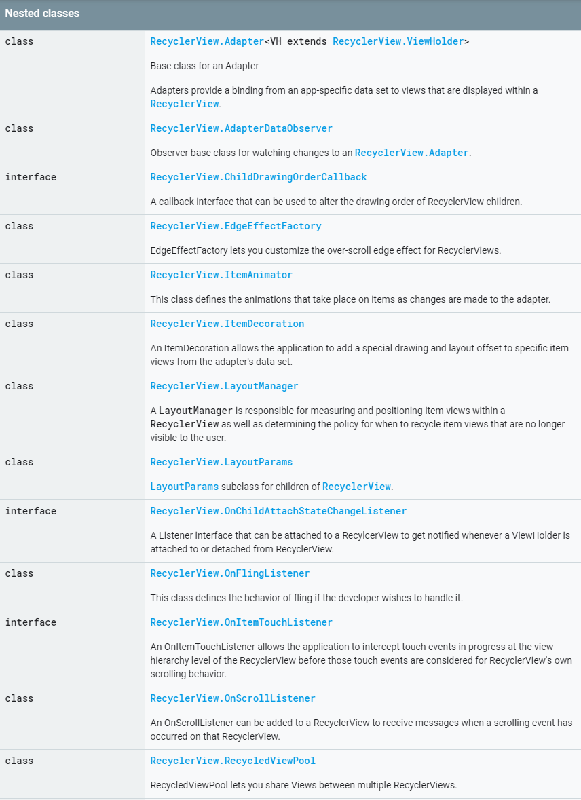

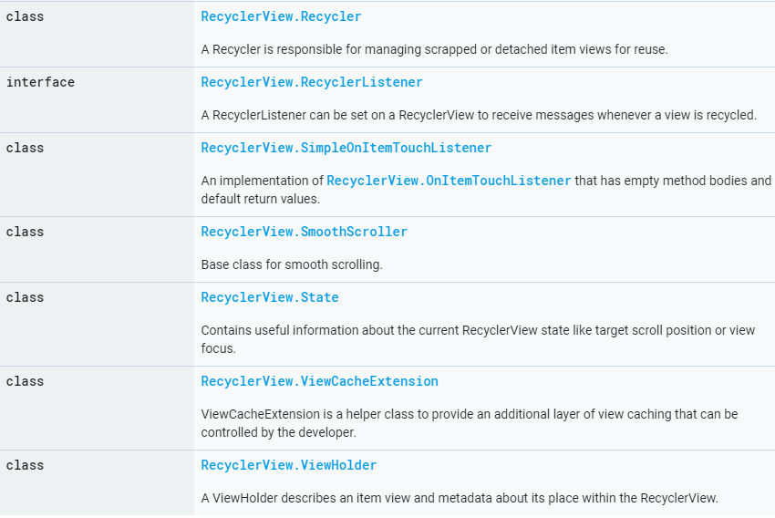

# RecyclerView.Adapter
## Summary
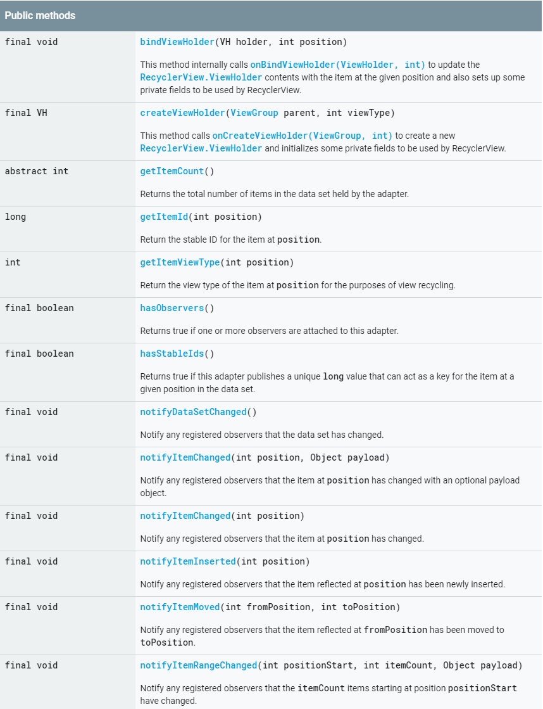

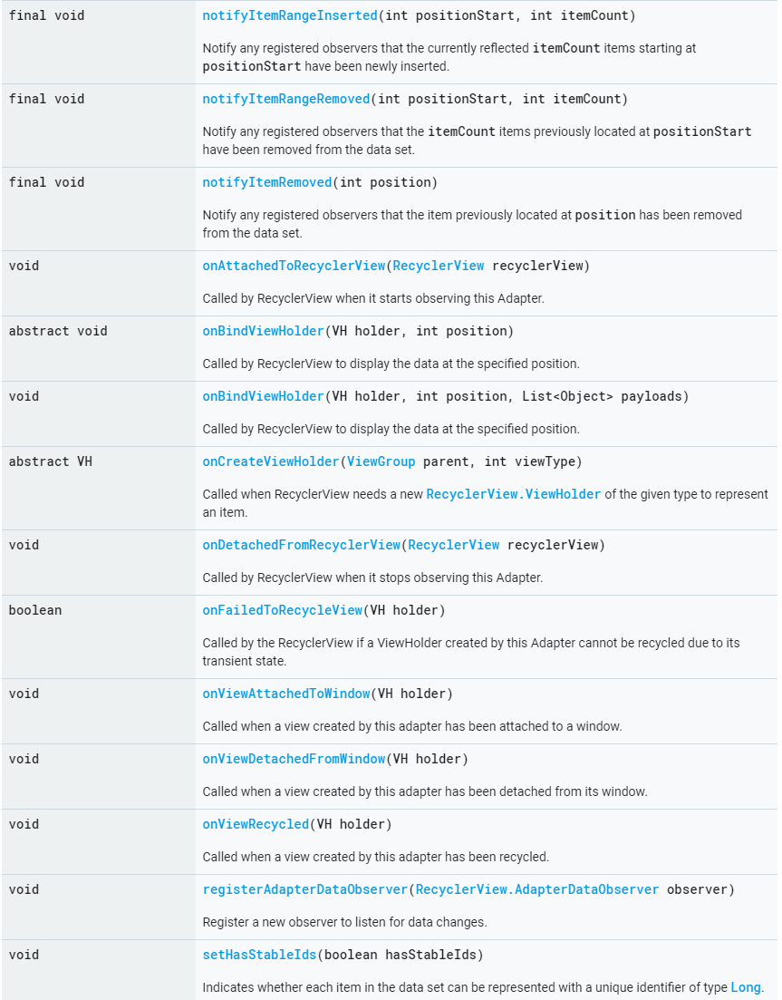

## Public Methods
### notifyDataSetChanged 
通知所有已注册的观察者，该数据集已改变。
有两种数据变化：item change 和 structural change。item change是指数据更新，但是位置没有变化。structural change是指数据发生插入、删除、移动等操作。
该方法并没有指定数据集发生何种变化，强制所有观察者假定目前所有数据均失效，需要重新绑定以及布局。
尽量使用更具体的方法，这样会更有效。万不得已，可以采用该方法。
更有效的和更具体的方法，参考：
notifyItemChanged(int)
notifyItemInserted(int)
notifyItemRemoved(int)
notifyItemRangeChanged(int, int)
notifyItemRangeInserted(int, int)
notifyItemRangeRemoved(int, int)

**注意：这些具体的刷新方法会造成屏幕闪以下** 

### onBindViewHolder
此方法用于在RecyclerView中显示数据。**注意：** 与ListView不同，除非数据集发生变化，否则此方法不会再次调用。因此，应在此方法内使用position，不要再保留position的副本，当需要position时，通过getAdapterPosition方法获取最新的position。

# RecyclerView.AdapterDataObserver
## Summary
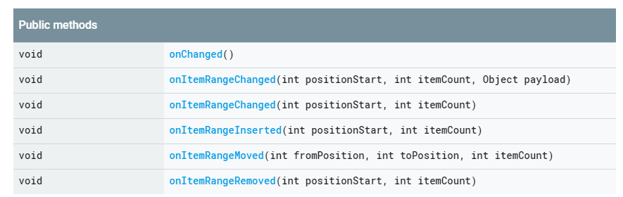

# RecyclerView.ItemAnimator
## 类介绍
此类主要是为了Adapter 的item配置动画的。ItemAnimator的子类可以在ViewHolder上实现自定义动画。但是实现ViewHolder的动画时，必须调用dispatchAnimatorFnished(ViewHolder)。换句话说，对于每个animateAppearance()、animateChange()、animatePersistence()和animateDisappearance()调用，都必须有一个匹配的dispatchAnimationFinished（ViewHolder）调用。
默认情况下，RecyclerView使用DefaultItemAnimator。

## Summary
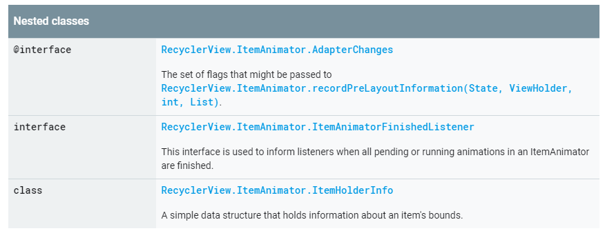

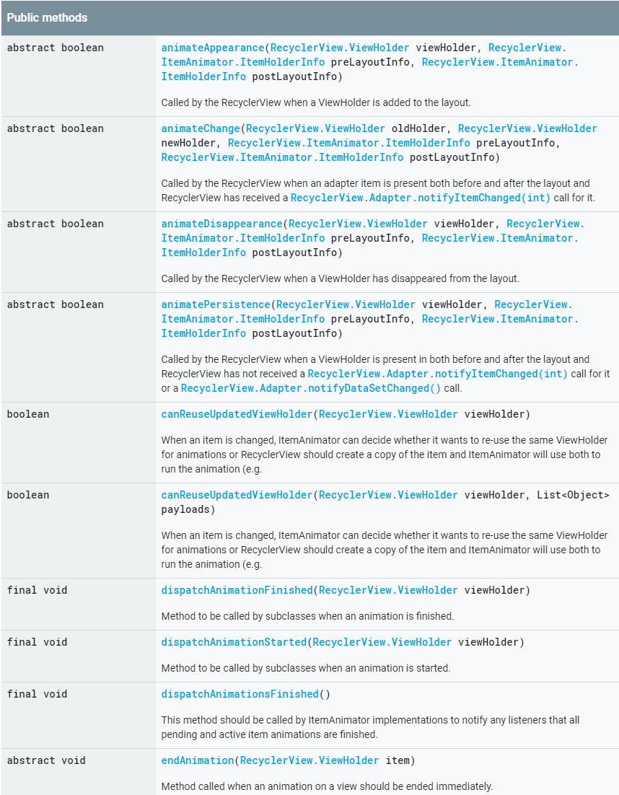

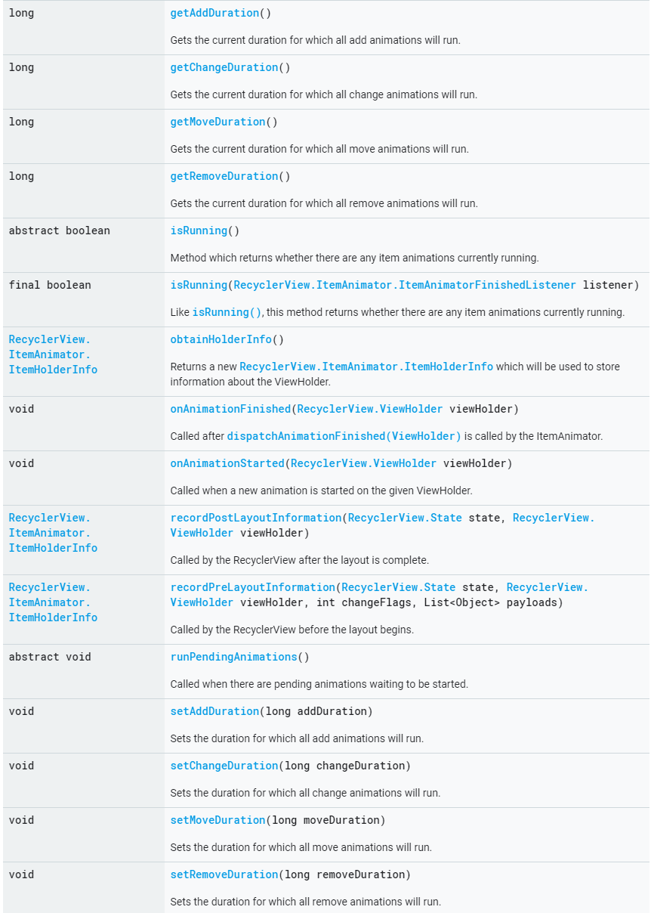

## public Methods
### animateAppearance
将ViewHolder添加到布局时，RecyclerView调用此方法
也就是说，在布局开始的时候ViewHolder was not a child，它可能是新增到Adapter或者由于其他原因变得可见。动画完成后，必须调用dispatchAnimationFinished（ViewHolder）
### animateChange
布局之前与布局之后Adapter item都存在且收到notifyItemChanged(int)时，RecyclerView调用此方法。当调用notifyDataSetChanged()并且Adapter具有稳定的ID时，该方法也会被调用。但是，当调用notifyDataSetChanged()时ViewType发生改变，则此方法不会调用，而是为新的ViewHolder调用animateAppearance方法，并将旧的ViewHolder回收。

**如果是由notifyDataSetChanged()调用此方法，则很有可能内容并未真正改变而是从Adapter重新绑定，如果Item的位置没有改变，DefaultAnimator将跳过动画，这一点需要考虑并且注意到** 

在更新item时，ItemAnimator可以选择保持之前的item并为新的显示提供新的ViewHolder（参阅canReuseUpdatedViewHolder）。在你不知道item的内容并想交叉新旧item时，会很有用。（DefaultAnimator使用了此技术）。

在调用notifyItemChanged(int)时，item的视图类型有可能发生改变。如果在调用参阅canReuseUpdatedViewHolder()的时候item的视图类型已更改或者ItemAnimator返回false，则oldHolder和newHolder将代表同一item的不同ViewHolder实例，此时，只有新的ViewHolder对LayoutManager可见，但是RecyclerView保留了旧的ViewHolder。
如果新旧ViewHolder是相同的实例，则仅调用一次dispatchAnimationFinished（ViewHolder）。

**注意： 当一个ViewHolder在相同的布局遍历中发生变化和消失(changes and diasppear)， RecyclerView的动画回调方法取决于两点：
1、ItemAnimator是否重用同一ViewHolder
2、LayoutManager是否布局已消失的ViewHolder的变化版本。
当且仅当canReuseUpdatedViewHolder返回false并且LayoutManager布置一个新的disappearing view来保存更新的消息时， RecyclerView才会调用animateChange而不是animateDiasppearance。内置的LauoutManager尝试避免去布局disappearing view的更新版本。** 

### animateDisappearance
当ViewHolder从布局中消失时，调用该方法。

这意味着，在布局开始时，View是LayoutManager的Child，但是被LayoutManager删除了。它可能从Adapter中删除或者仅仅变得不可见。可以检查传递给recordPreLayoutInformation的change flag来区分这两种情况。

如果LayoutManager支持预测动画，则可以通过将View放置在该位置来为其提供目标消失位置。发生这种情况时，RecyclerView将调用recordPostLayoutManager，并且将该调用的响应作为postLayoutInfo传递给此方法。

### animatePersistence
当ViewHolder在布局前后都存在且RecyclerView还未收到notifyItemChanged或者notifyDataSetChanged，调用该方法。

该ViewHolder仍展示布局开始时刻所展示的数据，但是其位置/大小可能已经被LayoutManager更改。

如果Item的布局位置没有改变，RecyclerView仍旧调用此方法因为它不会跟踪此信息（或者不一定知道 不需要动画）。你的ItemAnimator应该处理这种情况，如果没有要进行动画处理的内容，则应调用dispatchAnimationFinished并返回false。

### canReuseUpdatedViewHolder
当item发生改变，ItemAnimator可以决定是否使用同一ViewHolder进行动画，还是RecyclerView创建该item的副本，并且ItemAnimator使用这两者来运行动画（如淡入淡出）。

**注意：** 只有ViewHolder具有相同类型（getItemViewType）时，才会调用此方法。否则，ItemAnimator将始终在animateChange方法中接收这两个ViewHolder。

### dispatchAnimationFinished
当动画结束时由子类调用此方法。

对于animanteChange，如果oldViewHolder和newViewHolder不是同一个实例，子类应该调用两次此方法（每一个ViewHolder调用一次)

## ItemHolderInfo
### 简介
一个保存了item边界信息的数据结构，此信息用于计算item动画。

recordPreLayoutInformation和recordPostLayoutInformation默认返回此数据结构。如果你想保留有关视图的更多信息，可以扩展此类。

### Summary
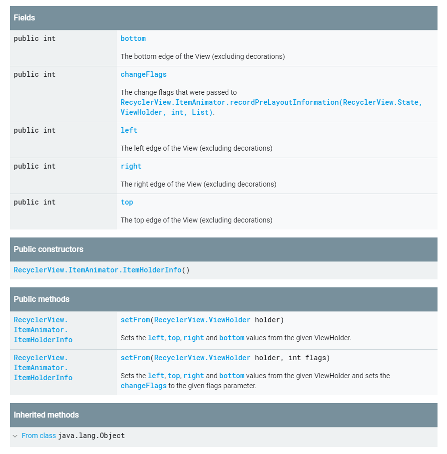

# RecyclerView.ItemDecoration
## 简介
主要用于设置RecyclerView的分割线的样式

## Summary
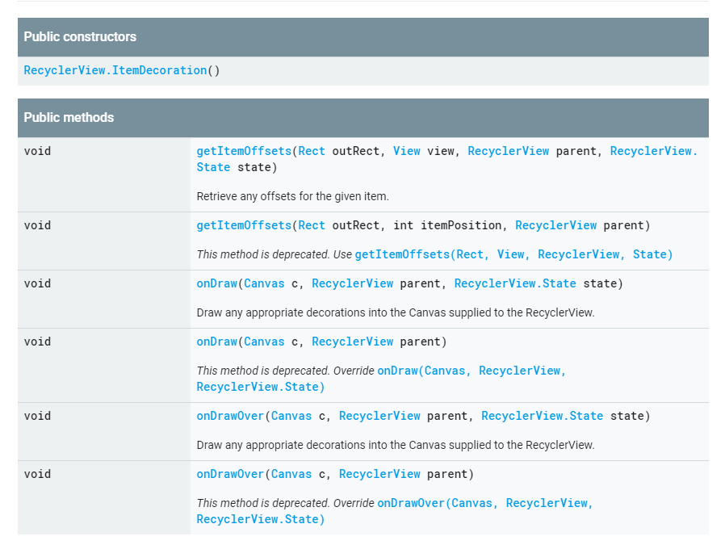

# RecyclerView.LayoutManager
## 简介
LayoutManager负责在RecyclerView中测量和放置item，并确定何时回收不可见item的策略。通过更改LayoutManager可以实现各种布局：垂直滚动、表格、交错网格、水平滚动等。LayoutManager提供了几种形式以供日常使用。

如果LayoutManager指定默认的狗在函数或带有签名的默认构造函数(Context  AttributeSet  int  int)，则RecyclerView将在inflate的时候实例化并设置LayoutManager。可以从getProperities中获得最常用的属性。如果LayoutManager同时指定了两个构造函数，则非默认构造函数将优先。

## Summary
方法太多，不粘贴了。。
[public methods](https://developer.android.com/reference/androidx/recyclerview/widget/RecyclerView.LayoutManager)

# RecyclerView.LayoutParams
## Summary
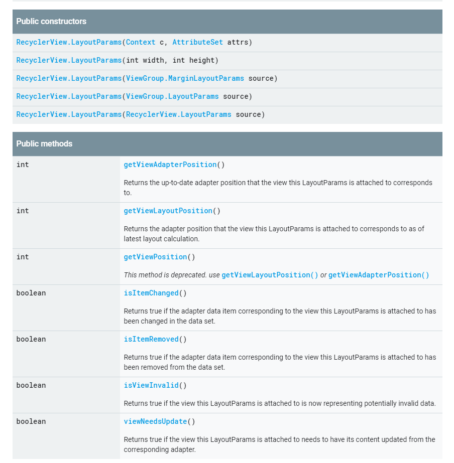

# RecyclerView.ViewHolder
## Summary
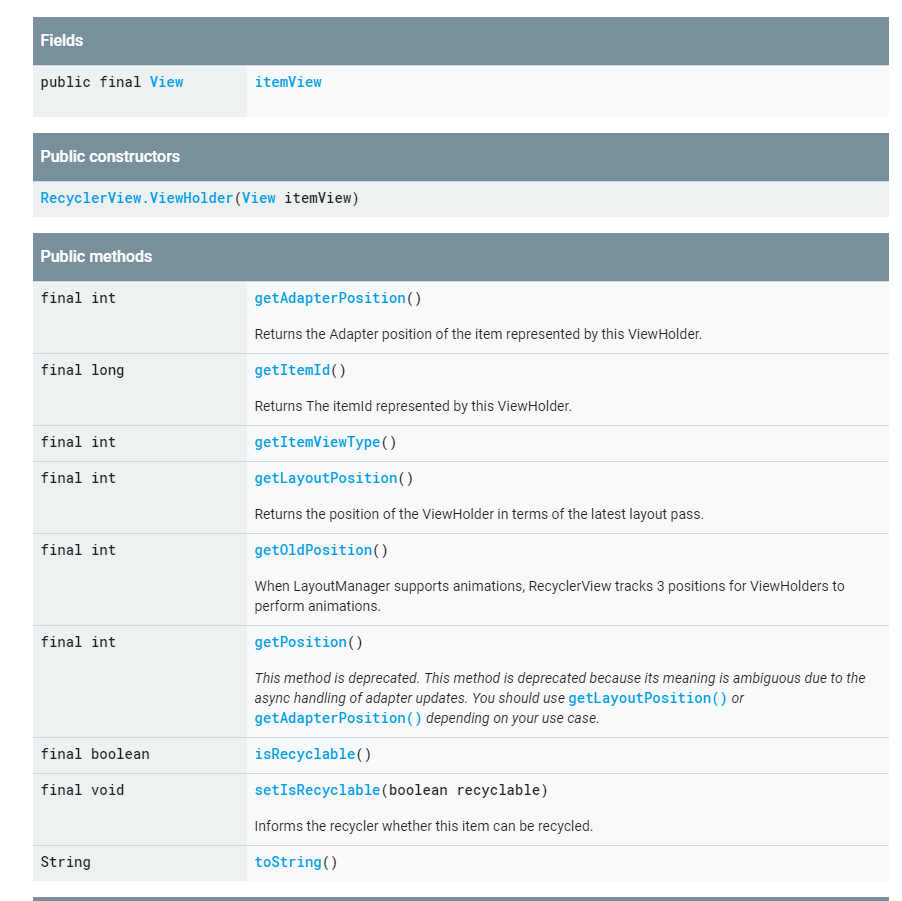

# 参考：
[Developer介绍](https://developer.android.com/reference/androidx/recyclerview/widget/RecyclerView)