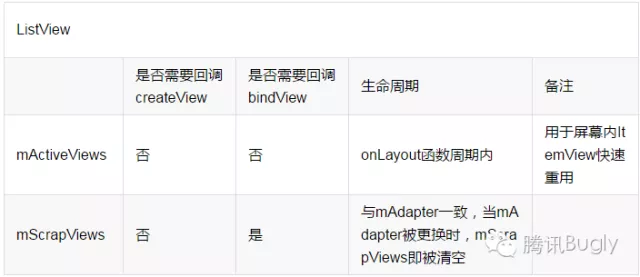

# 概述

Developer中RecyclerView翻译
RecyclerView.Adapter 
RecyclerView.LayoutManager 
RecyclerView.ItemAnimator  
RecyclerView.Decoration
拓展RecyclerView：HeaderView   FooterView
嵌套滑动（吸顶功能）

# RecyclerView的优点
1、封装了ViewHolder
2、提供了一种拔插式的体验，高度的解耦
3、设置布局管理器控制Item的布局。
4、可设置Item的Divider样式
5、可控制Item的动画
6、支持局部刷新

# RecyclerView的四大组成部分
1、Adapter ：提供数据
2、LayoutManager：  控制布局样式
3、ItemAnimator：  Item动画
4、Decoration：  Item之间的Divider

# 基本使用方式
~~~
recyclerView = (RecyclerView) findViewById(R.id.recyclerView);  
LinearLayoutManager layoutManager = new LinearLayoutManager(this );  
//设置布局管理器  
recyclerView.setLayoutManager(layoutManager); 

//设置为垂直布局，这也是默认的  
layoutManager.setOrientation(OrientationHelper. VERTICAL);  

//设置Adapter  
recyclerView.setAdapter(recycleAdapter);  

 //设置分隔线  
recyclerView.addItemDecoration( new DividerGridItemDecoration(this ));  

//设置增加或删除条目的动画  
recyclerView.setItemAnimator( new DefaultItemAnimator());  
~~~
Adapter:
~~~
// ① 创建Adapter
public class NormalAdapter extends RecyclerView.Adapter<NormalAdapter.VH>{
    //② 创建ViewHolder
    public static class VH extends RecyclerView.ViewHolder{
        public final TextView title;
        public VH(View v) {
            super(v);
            title = (TextView) v.findViewById(R.id.title);
        }
    }
    
    private List<String> mDatas;
    public NormalAdapter(List<String> data) {
        this.mDatas = data;
    }

    //③ 在Adapter中实现3个方法
    @Override
    public void onBindViewHolder(VH holder, int position) {
        holder.title.setText(mDatas.get(position));
        holder.itemView.setOnClickListener(new View.OnClickListener() {
            @Override
            public void onClick(View v) {
                //item 点击事件
            }
        });
    }

    @Override
    public int getItemCount() {
        return mDatas.size();
    }

    @Override
    public VH onCreateViewHolder(ViewGroup parent, int viewType) {
        //LayoutInflater.from指定写法
        View v = LayoutInflater.from(parent.getContext()).inflate(R.layout.item_1, parent, false);
        return new VH(v);
    }
}
~~~
# RecyclerView的缓存机制
## RecyclerView的缓存类
RecyclerView的缓存基本是通过三个内部类管理的： Recycler、RecycledViewPool和ViewCacheExtension.

### Recycler
Recycler用于管理已经废弃或者与RecyclerView分离的ViewHolder，RecyclerView的成员变量及其作用：

### RecyclerViewPool
RecyclerViewPool类是用来缓存Item用，是一个ViewHolder的缓存池，如果多个RecyclerView之间用setRecycledViewPool(RecycledViewPool)设置同一个RecycledViewPool，他们就可以共享Item。其实RecycledViewPool的内部维护一个Map。里面以不同的ViewType为key值存储了各自对应的ViewHolder的集合。可以通过提供的方法来修改内部缓存的ViewHolder。

### ViewCacheExtension
开发者可以自定义的一层缓存，是抽象类ViewCacheExtension的一个实例，开发者可实现方法fetViewForPositionAndType(Recycler recycler, int position ,int type)来实现自己的缓存

## RecyclerView的四级缓存
### 屏幕内缓存
屏幕内缓存指在屏幕中显示的ViewHolder，这些ViewHolder会缓存在mAttachedScrap、mChangedScrap中。

### 屏幕外缓存
当列表滑动出了屏幕，ViewHolder会被缓存在mCachedViews，其大小由mViewCacheMax决定，默认DEFAULT_CACHE_SIZE为2，可通过RecyclerView.setItemViewCacheSize()动态设置。

### 自定义缓存
可以自己实现ViewCacheExtension类实现自定义缓存，可通过Recyclerview.setViewCacheExtension()设置。

### 缓存池(RecycledViewPool)
ViewHolder在首先会缓存在 mCachedViews 中，当超过了个数（比如默认为2）， 就会添加到 RecycledViewPool 中。RecycledViewPool 会根据每个ViewType把ViewHolder分别存储在不同的列表中，每个ViewType最多缓存DEFAULT_MAX_SCRAP = 5 个ViewHolder，如果RecycledViewPool没有被多个RecycledView共享，对于线性布局，每个ViewType最多只有一个缓存，如果是网格有多少行就缓存多少个。他们之间的关系如下 :

## 缓存策略
Recyclerview在获取ViewHolder时按四级缓存的顺序查找，如果没找到就创建。其中只有RecycledViewPool找到时才会调用 bindViewHolder，其它缓存不会重新bindViewHolder 。 
流程如下 :

## 总结
通过了解RecyclerView的四级缓存，我们可以知道，RecyclerView最多可以缓存 N（屏幕最多可显示的item数） + 2 (屏幕外的缓存) + 5* M (M代表M个ViewType，缓存池的缓存)，只有RecycledViewPool找到时才会重新调用 bindViewHolder。

还需要注意的是，RecycledViewPool 可以被多个RecyclerView共享，其缓存个数与ViewType个数、布局相关，如果RecycledViewPool没有被多个RecycledView共享，对于线性布局，每个ViewType最多只有一个缓存，如果是网格布局有多少行就缓存多少个。

# RecyclerView  VS ListView
## 优缺点
ListVIew：
1、可以通过addHeaderView()、addFooterView()添加头视图与尾视图
2、通过android:divider设置分割线
3、setOnItemClickListener()、setOnItemLongClickListener()设置点击事件

RecyclerView:
1、默认实现View的复用
2、默认支持局部刷新
3、容易实现Item动画

## 缓存机制比较
### 层级不同
RecyclerView比ListView多两级缓存，支持多个ItemView缓存，支持开发者自定义缓存逻辑，支持所有RecyclerView共用一个RecyclerViewPool。

具体来说：
ListView（两级缓存）：

RecyclerView（四级缓存）

ListView和RecyclerView缓存机制基本一致：
1). mActiveViews和mAttachedScrap功能相似，意义在于快速重用屏幕上可见的列表项ItemView，而不需要重新createView和bindView；

2). mScrapView和mCachedViews + mReyclerViewPool功能相似，意义在于缓存离开屏幕的ItemView，目的是让即将进入屏幕的ItemView重用.

3). RecyclerView的优势在于
a.mCacheViews的使用，可以做到屏幕外的列表项ItemView进入屏幕内时也无须bindView快速重用；
b.mRecyclerPool可以供多个RecyclerView共同使用，在特定场景下，如viewpaper+多个列表页下有优势.
客观来说，RecyclerView在特定场景下对ListView的缓存机制做了补强和完善。

### 缓存不同
1). RecyclerView缓存RecyclerView.ViewHolder，抽象可理解为： 
View + ViewHolder(避免每次createView时调用findViewById) + flag(标识状态)； 
2). ListView缓存View。
缓存不同，二者在缓存的使用上也略有差别，具体来说： 

ListView获取缓存的流程：

RecyclerView获取缓存的流程：

1、 RecyclerView中mCacheViews(屏幕外)获取缓存时，是通过匹配pos获取目标位置的缓存，这样做的好处是，当数据源数据不变的情况下，无须重新bindView。而同样是离屏缓存，ListView从mScrapViews根据pos获取相应的缓存，但是并没有直接使用，而是重新getView（即必定会重新bindView）

2、ListView中通过pos获取的是view，即pos–>view； RecyclerView中通过pos获取的是viewholder，即pos –> (view，viewHolder，flag)； 从流程图中可以看出，标志flag的作用是判断view是否需要重新bindView，这也是RecyclerView实现局部刷新的一个核心.

# 扩展阅读(参考)
[RecyclerView Google I/O 2016](https://v.youku.com/v_show/id_XMTU4MTQ1ODg2NA==.html?f=27314446)
[RecyclerView优秀文集](https://github.com/CymChad/CymChad.github.io)
[关于RecyclerView的缓存机制的理解](https://zhooker.github.io/2017/08/14/%E5%85%B3%E4%BA%8ERecyclerview%E7%9A%84%E7%BC%93%E5%AD%98%E6%9C%BA%E5%88%B6%E7%9A%84%E7%90%86%E8%A7%A3/)
[Android ListView 与RecyclerView对比浅析--缓存机制](https://www.jianshu.com/p/193fb966e954)