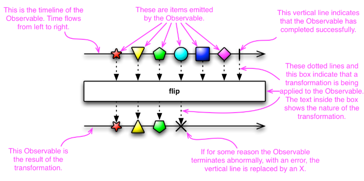
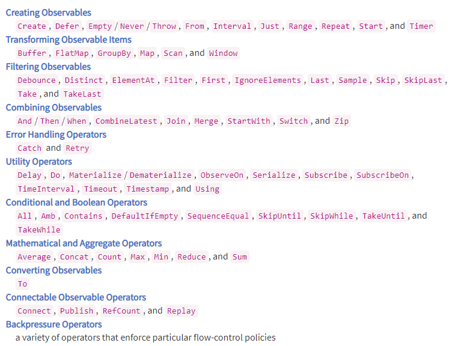
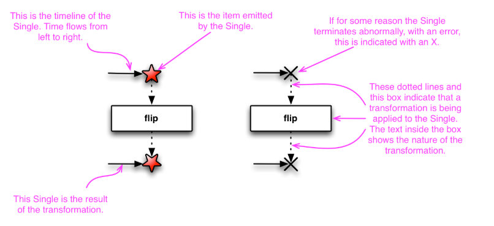
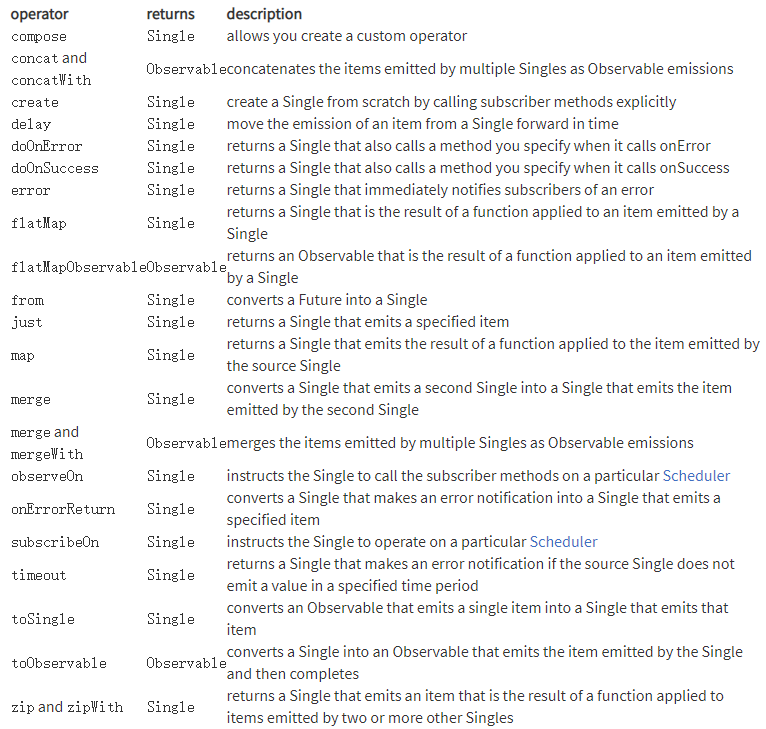

# 简介
Rxjava是Reactive X在JVM上的实现。实际上就是提供一套异步编程的API，这套API是基于观察者模式的。

# [Observable](http://reactivex.io/documentation/observable.html)

在ReactiveX中，观察者(observer)订阅了一个Observable。 然后，该观察者对Observable发出(emit)的任何项目或项目序列做出反应。 这种模式有助于并发操作，因为它在等待Observable发出对象时不会阻塞，而是以观察者的形式创建了一个哨兵，随时准备在Observable以后的任何时间做出适当的反应。

本页解释了什么是反应模式(the reactive pattern)以及什么是可观察对象(observable)和观察者(observer)（以及观察者如何订阅可观察对象）。 其他页面显示了如何使用各种Observable运算符将Observable链接在一起并更改其行为。

本文档在解释时附带“marble diagrams”。这是marble diagrams如何表示可观察对象和可观察对象的转换的方法：

## background
在许多编程任务中，您或多或少希望编写的指令能够按照编写顺序一步一步执行。但是在ReactiveX中，许多指令可能并行执行，并且"observer"以任意顺序捕获结果。您无需调用方法，而是以“observable”形式定义了一种用于检索和转换数据的机制，然后让观察者订阅它，此时，先前定义的机制将在观察者站岗的情况下启动，以随时捕获并响应其分发事件。

这种方法的优点是，当您有一堆彼此不依赖的任务时，您可以同时启动所有任务，而不必等每个任务都完成才开始下一个任务-这样，整个任务序列的完成时间就是序列中最长任务所花费的时间。

有许多术语用来描述这种异步编程和设计模型。 本文档将使用以下术语：观察者(observer)订阅一个Observable。 一个Observable通过调用观察者的方法发出项目或向其观察者发送通知。

在其他文档和其他上下文中，我们所谓的“观察者”有时也称为“subscriber”，“watcher”或“reactor”。通常将此模型通常称为“reactor pattern”。

## Establishing Observers
该页面的示例使用类似于Groovy的伪代码，但是有许多语言的ReactiveX实现。

在普通的方法调用中（即不是ReactiveX中典型的那种异步并行调用），流程如下所示：
1、调用方法。
2、将该方法的返回值存储在变量中。
3、使用该变量及其新值可以执行一些有用的操作。

或者像这样：
~~~
// make the call, assign its return value to `returnVal`
returnVal = someMethod(itsParameters);
// do something useful with returnVal
~~~
在异步模型中，流程大多像这样：
1、定义一个对异步调用的返回值有用的方法； 此方法是观察者的一部分。
2、将异步调用本身定义为Observable。
3、通过订阅观察者，将观察者附加到该Observable上（这也会启动观察者的动作）。
4、继续您的工作； 每当调用返回时，观察者的方法将开始对其返回值或Observable发出的值进行操作。

看起来像这样的流程：
~~~
// defines, but does not invoke, the Subscriber's onNext handler
// (in this example, the observer is very simple and has only an onNext handler)
def myOnNext = { it -> do something useful with it };
// defines, but does not invoke, the Observable
def myObservable = someObservable(itsParameters);
// subscribes the Subscriber to the Observable, and invokes the Observable
myObservable.subscribe(myOnNext);
// go on about my business
~~~

### onNext, onCompleted, onError
Subscribe方法是将观察者连接到Observable的方式。 您的观察者实现了以下方法的一部分：

#### onNext
每当Observable发出项目时，Observable就会调用此方法。 此方法将Observable发出的项目作为参数。

#### onCompleted
如果Observable尚未遇到任何错误，则在最后一次调用onNext之后将调用此方法。

#### onError
一个Observable调用此方法以指示它未能生成期望的数据或遇到了其他错误。 它不会进一步调用onNext或onCompleted。 onError方法将导致错误的原因指示为参数。

根据Observable合同的条款，它可以调用onNext零次或多次，然后可以在这些调用之后调用onCompleted或onError，但不能同时调用这两者，这将是其最后一次调用。 按照约定，在本文档中，对onNext的调用通常称为项目的“emission”，而对onCompleted或onError的调用称为“notification”。

完整的subscribe调用像这样：
~~~
def myOnNext     = { item -> /* do something useful with item */ };
def myError      = { throwable -> /* react sensibly to a failed call */ };
def myComplete   = { /* clean up after the final response */ };
def myObservable = someMethod(itsParameters);
myObservable.subscribe(myOnNext, myError, myComplete);
// go on about my business
~~~

### Unsubscribing
在某些ReactiveX实现中，存在一个专用的观察者接口Subscriber，该接口实现了unsubscribe方法。 您可以调用此方法以指示Subscriber不再对其当前订阅的任何Observable感兴趣。 然后，那些Observable（如果没有其他感兴趣的观察者）可以选择停止生成要发射(emit)的新项目。

unsubscribe的结果将通过观察者订阅的适用于Observable的运算符链级联返回，这将导致链中的每个链接停止发射项目。 但是，这并不能保证立即发生，即使没有观察员留下来观察这些发射，Observable也有可能产生并尝试发射一段时间。

### Some Notes on Naming Conventions
ReactiveX的每种特定于语言的实现都有其自己的命名怪癖。 尽管实现之间存在许多共性，但是没有规范的命名标准。

此外，其中一些名称在其他上下文中具有不同的含义，或者在特定实现语言的习惯用法中显得有些尴尬。

例如，存在onEvent命名模式（例如onNext，onCompleted，onError）。 在某些情况下，此类名称将指示通过其注册事件处理程序的方法。 但是，在ReactiveX中，它们自己命名事件处理程序。

## “Hot” and “Cold” Observables
Observable何时开始发出其项目序列？ 这取决于Observable。
Hot Observable 在创建之后就开始发送item，无论是否有Observer。
Cold Observable 只有在有Observer订阅之后才发送item。

在ReactiveX的某些实现中，还有一个称为“Connectable”的observable。 这样的Observable直到调用其Connect方法时才开始发出项目，无论是否有任何观察者已订阅它。

## Composition via Observable Operators
可观察者和观察者只是ReactiveX的开始。 就其本身而言，它们不过是标准观察者模式的略微扩展，更适合于处理一系列事件，而不是单个回调。

真正的强大功能来自“reactive extensions”（以下称为“ ReactiveX”），这些运算符使您可以转换，组合，操作和处理Observables发出的项目序列。

这些Rx运算符允许您以声明的方式将异步序列组合在一起，同时具有回调的所有效率优势，但没有通常异步系统关联的回调处理程序的缺点。

### chain operators<链式调用>
大多数运算符对Observable进行操作并返回Observable。 这使您可以在链中一个接一个地应用这些运算符。 链中的每个运算符都会修改前一个运算符的操作所产生的Observable。

还有其他模式，例如“构建器模式(builder pattern)”，在该模式中，特定类的各种方法通过通过该方法的操作修改该对象来对该相同类的项目进行操作。 这些模式还允许您以类似方式链接方法。 但是，在构建器模式中，方法在链中出现的顺序通常并不重要，而Observable运算符的顺序则很重要。

一系列Observable运算符并不是在起源于该链的原始Observable上独立运行，而是依次运行，每个操作都由该链中紧接在前的运算符生成。

# [Single](http://reactivex.io/documentation/single.html)
RxJava（及其衍生产品，如RxGroovy和RxScala）已经开发了一个称为“单一”的Observable变体。

Single就像是一个Observable，但是不发出一系列值，它总是发出一个值或错误通知。

因此，您不必使用三种方法来响应来自Observable的通知（onNext，onError和onCompleted）来订阅Single，而是仅使用两种方法进行订阅：

onSuccess
Single通过此方法将Single发出的唯一项目

onError
导致此Single无法发送的Throwable

Single将仅调用这些方法之一，并且只会调用一次。 调用任一方法后，Single终止，对其的订阅结束。

## Composition via Single Operators
像Observables一样，可以通过多种运算符来操纵Singles。 一些运算符还允许在Observable和Single之间建立接口，以便您可以混合使用两种变体：

该页的以下各节将提供marble diagrams，以示意图方式说明这些操作符。 下图说明了如何在marble diagrams中表示Single ：

**(操作符的示意图，看官网说明)

# [Scheduler](http://reactivex.io/documentation/scheduler.html)

如果要将多线程引入可观察运算符的级联中，可以通过指示那些运算符（或特定的可观察变量）在特定的调度程序上进行操作来实现。

一些ReactiveX Observable运算符具有将Scheduler作为参数的变体。这些指示操作员在特定的调度程序上执行其部分或全部工作。

默认情况下，一个Observable及其所应用的运算符链将在调用其Subscribe方法的同一线程上完成其工作，并通知其观察者。 SubscribeOn运算符通过指定应在其上运行Observable的另一个Scheduler来更改此行为。 ObserveOn运算符指定一个不同的Scheduler，Observable将使用该Scheduler向其观察者发送通知。

如此图所示，SubscribeOn运算符指定Observable将在哪个线程上开始操作，无论该运算符在运算符链中的哪个点被调用。另一方面，ObserveOn影响Observable将在该运算符出现的位置使用的线程。因此，您可以在Observable运算符链中的各个点多次调用ObserveOn，以更改某些运算符在哪些线程上进行操作。

# 参考博客

郭霖推荐：
[RxJava So Easy! 带你从0手撸一个RxJava](https://juejin.im/post/6882294077606330381)

Carson的博客
[Carson的Rxjava系列博客](https://www.jianshu.com/nb/14302692)
[Android Rxjava：这是一篇 清晰 & 易懂的Rxjava 入门教程](https://www.jianshu.com/p/a406b94f3188)

系列博客：
[关于RxJava最友好的文章（初级篇）](https://zhuanlan.zhihu.com/p/23584382)
[关于RxJava最友好的文章——背压（Backpressure）](https://zhuanlan.zhihu.com/p/24473022?refer=dreawer)
[关于RxJava最友好的文章（进阶篇）](https://zhuanlan.zhihu.com/p/23585300)
[RxJava示例程序](https://github.com/ladingwu/ApplicationDemo)
[关于 RxJava 最友好的文章—— RxJava 2.0 全新来袭](https://zhuanlan.zhihu.com/p/24482660)

抛物线的示例代码
[RXJAVA详解](http://gank.io/post/560e15be2dca930e00da1083)
[Rxjava的例子](https://github.com/rengwuxian/RxJavaSamples)
[比较全的RxJava教程](https://alleniverson.gitbooks.io/rxjava-docs-for-android-developer/)

泽毛的简书---RxJava2实战系列15讲
[Rxjava2实战知识梳理](https://www.jianshu.com/p/c935d0860186)
[开源项目--Rxjava-Android-Sample](https://github.com/kaushikgopal/RxJava-Android-Samples)

# Retrofit
[Android Retrofit 2.0 的详细 使用攻略（含实例讲解）](https://www.jianshu.com/p/a3e162261ab6)