# 综述
## 简介
active的语音交互会话，为实现与语音交互层中的用户交互提供了便利。 默认情况下，最初显示用户界面，并且可以通过覆盖其中可以构建UI的onCreateContentView（）来创建该用户界面。

语音交互会话可以是独立的，完成后最终调用finish（）。 它还可以通过调用startVoiceActivity（Intent）来启动与应用程序的语音交互。
## summary
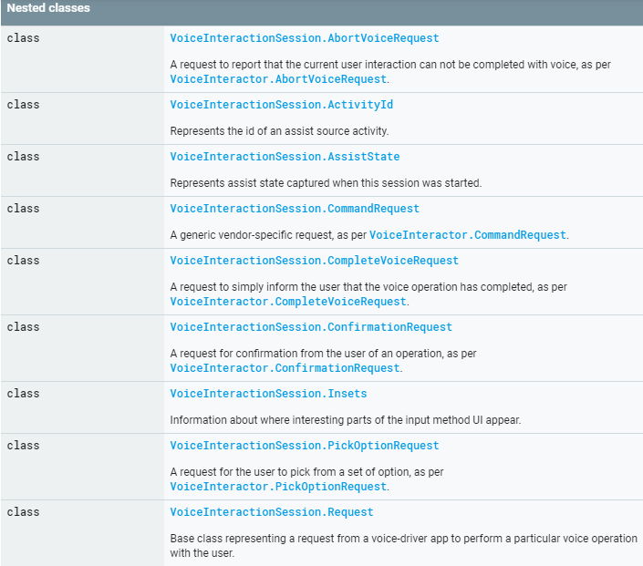
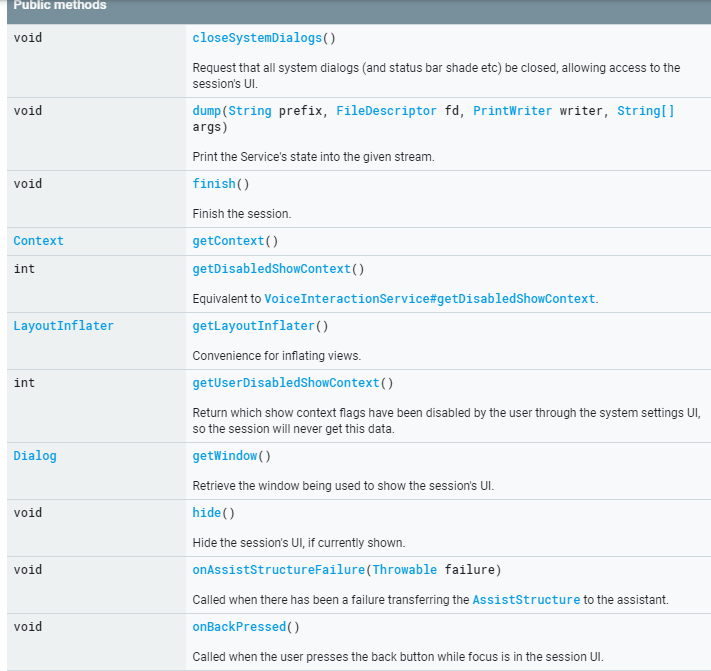

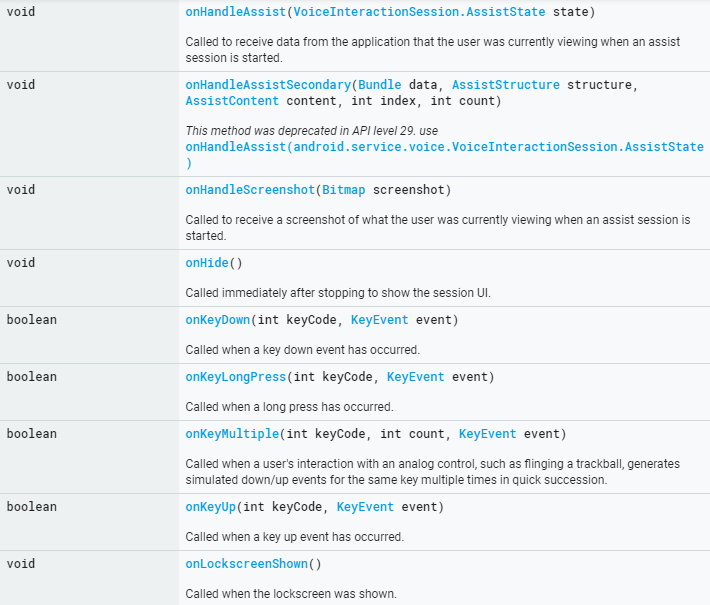
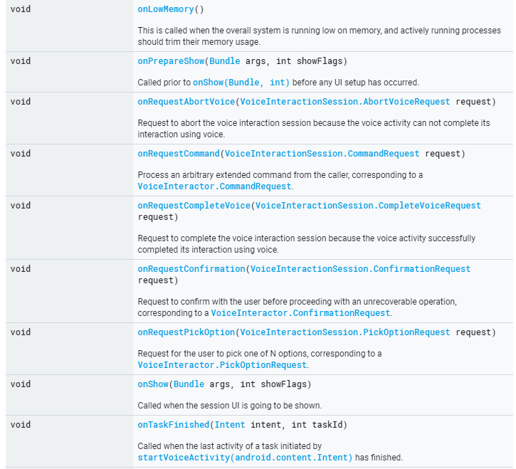
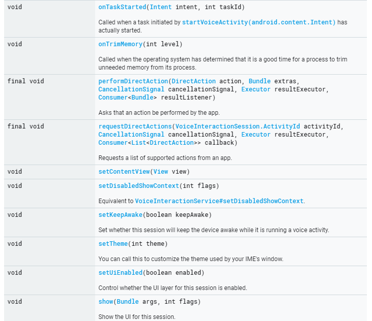
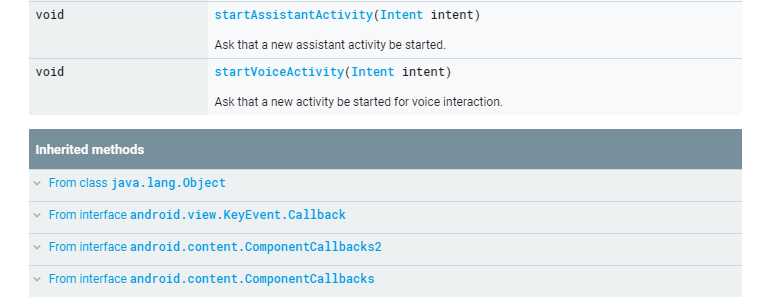

# VoiceInteractionSession.AbortVoiceRequest
## 简介
报告当前的交互无法通过语音完成，因此应用程序将需要切换到传统的输入UI。 应用程序仅应在需要完全摆脱语音交互并切换到传统UI时使用。 当响应返回时，语音系统已经处理了请求并准备切换。 此时，应用程序可以启动新的非语音活动。 确保在启动新活动时使用Intent.FLAG_ACTIVITY_NEW_TASK将新活动排除在当前语音交互任务之外。

## Summary
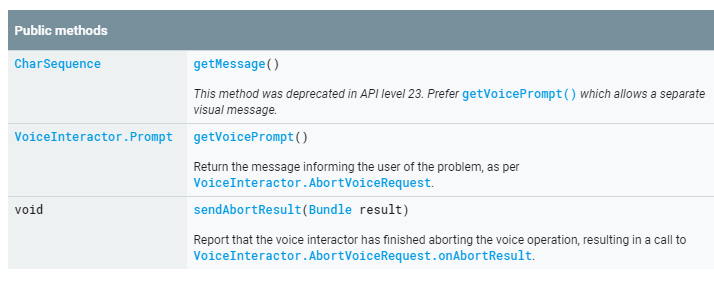

# VoiceInteractionSession.CommandRequest
## 简介
使用受信任的系统VoiceInteractionService执行特定于供应商的命令。 这样一来，活动就可以向用户请求完成操作所需的其他信息（例如，预订表格可能需要用户选择几次，或者应用可能需要用户同意服务条款）。 确认结果将通过对onCommandResult（boolean，android.os.Bundle）或VoiceInteractor.Request.onCancel（）的异步调用返回。

该命令是描述要执行的一般操作的字符串。 该命令将确定Extras中的属性如何解释，以及可用命令的集合会随着时间的增长而增长。 例如，“ com.google.voice.commands.REQUEST_NUMBER_BAGS”可以请求行李数量作为航空公司登机手续的一部分。 （这不是实际的工作示例。）

## Summary
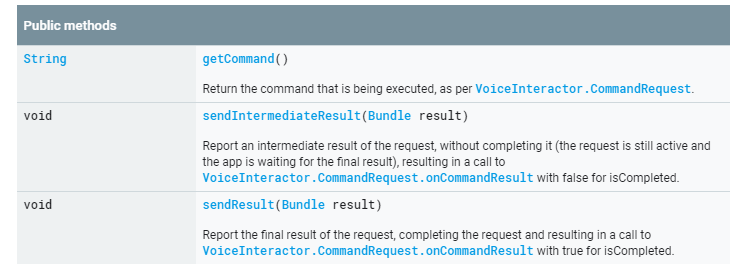

# VoiceInteractionSession.ConfirmationRequest
## 简介
通过受信任的系统VoiceInteractionService与用户确认操作。 这样，活动就可以完成一项不安全的操作，当未启用语音交互模式时，该操作将要求用户触摸屏幕。 确认的结果将通过对onConfirmationResult（boolean，android.os.Bundle）或VoiceInteractor.Request.onCancel（）的异步调用返回-应重写这些方法以定义应用程序特定的行为。

在某些情况下，这可能是简单的是/否确认，或者确认中可能包含有关如何完成操作的上下文信息（例如，预订出租车可能包括有关出租车到达多久的详细信息），以便用户可以进行确认。

## summary
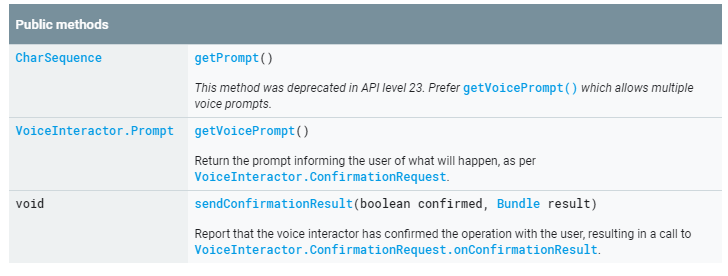

# VoiceInteractionSession.CompleteVoiceRequest
## 简介
报告当前交互已通过语音成功完成，因此应用程序可以将最终状态报告给用户。 当响应返回时，语音系统已经处理了请求并准备切换。 此时，应用程序可以开始新的非语音活动或完成。 确保在启动新活动时使用Intent.FLAG_ACTIVITY_NEW_TASK将新活动排除在当前语音交互任务之外。

## summary
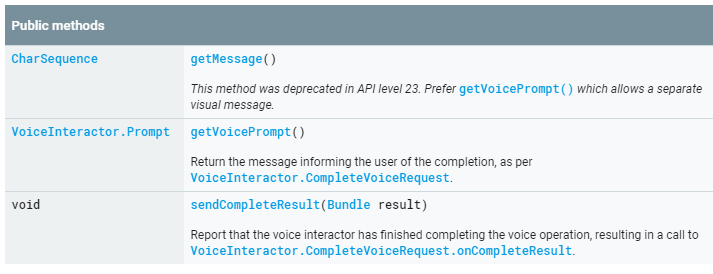

# VoiceInteractionSession.PickOptionRequest
## 简介
通过受信任的系统VoiceInteractionService与用户从多个潜在选项中选择一个选项。 通常，应用程序会将其直观地显示为列表视图，以允许通过触摸选择选项。 确认的结果将通过对onPickOptionResult（boolean，VoiceInteractor.PickOptionRequest.Option []，Bundle）或VoiceInteractor.Request.onCancel（）的异步调用返回-应该重写这些方法以定义应用程序特定的行为。

## summary
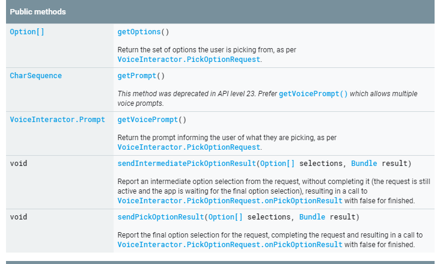

# VoiceInteractionSession.AssistState
## 简介
表示启动此会话时捕获的辅助状态。 它包含各种辅助数据对象和对源活动的引用。

## summary
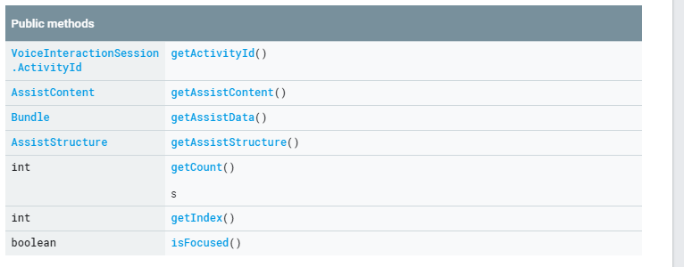

# VoiceInteractionSession.Request
## 简介
可以提交给交互器的语音交互请求的基类。 不要直接实例化它，而是使用适当的子类。

## summary
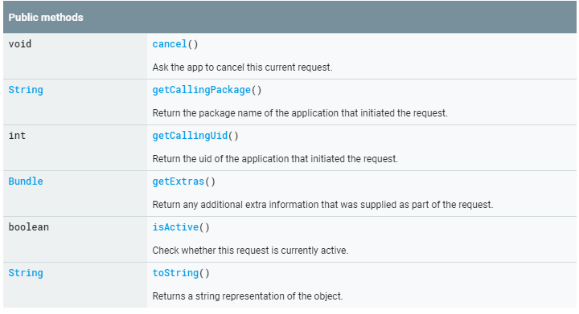

# VoiceInteractionSession.Insets
## 简介
有关输入法UI有趣部分出现位置的信息。

## summary
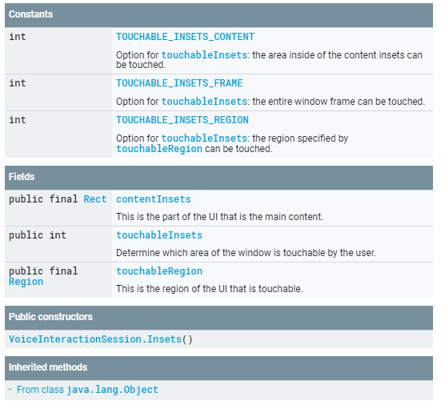

# VoiceInteractionSessionService
## 简介
由VoiceInteractionService发起的活动语音交互会话。

## summary
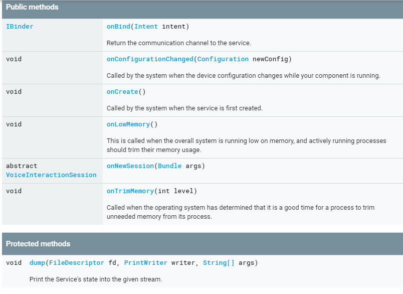
