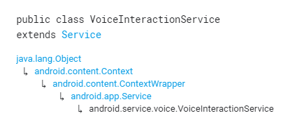

# 综述
## 简介

当前全局语音交互器的顶级服务，它支持字词搜索，VoiceInteractor的后端等。由用户选择的当前VoiceInteractionService始终由系统运行，以使其能够 做诸如在后台听热门单词来激发语音交互之类的事情。

由于此服务始终在运行，因此应使其尽可能轻巧。 当进行实际的语音交互时，应在关联的VoiceInteractionSessionService中实现重量级操作（包括显示UI），并且该服务应在与此独立的进程中运行。

## summary

# 链接
[android developer](https://developer.android.com/reference/android/service/voice/VoiceInteractionService)