# 综述
## 简介

活动（Activity）的界面，可通过语音与用户互动。如果当前活动涉及语音交互，请使用Activity.getVoiceInteractor检索接口。

语音交互器(Voice interactor)的工作为：与用户一起向后端语音交互服务提交语音交互请求。这些请求与SubmitRequest（VoiceInteractor.Request）一起提交，提供了一个Request子类的新实例，该实例描述了要执行的操作的类型----当前可能的请求为ConfirmationRequest和CommandRequest。

提交请求后，语音系统将对其进行处理，并最终将结果传递给请求对象。 该应用程序可以随时取消待处理的请求。

VoiceInteractor与Activity的状态保存机制集成在一起，因此，如果以保留状态重新启动活动，它将保留当前的VoiceInteractor和所有未完成的请求。 因此，您应该始终使用Request＃getActivity（）返回请求的活动，而不是自己通过非静态内部类显式或隐式地保留活动实例。

## Summary
### 内部类
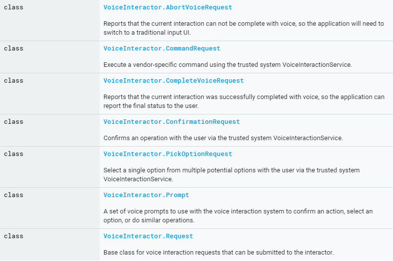

### public methods
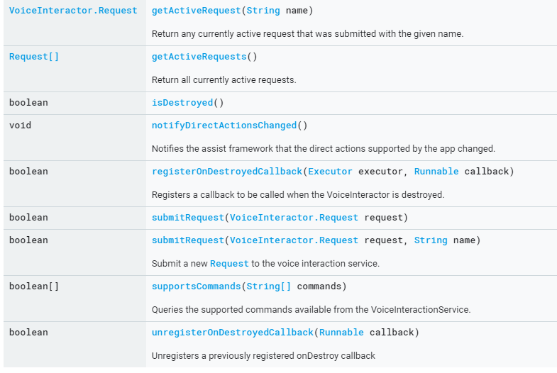

# VoiceInteractor.AbortVoiceRequest
## 简介
报告当前的交互无法通过语音完成，因此应用程序将需要切换到传统的输入UI。 应用程序仅应在需要完全摆脱语音交互并切换到传统UI时使用。 当响应返回时，语音系统已经处理了请求并准备切换。 此时，应用程序可以启动新的非语音活动。 确保在启动新活动时使用Intent.FLAG_ACTIVITY_NEW_TASK将新活动排除在当前语音交互任务之外。

## Summary
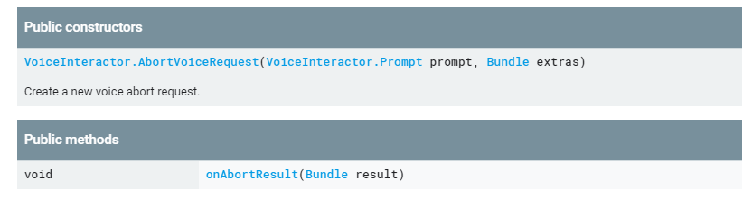
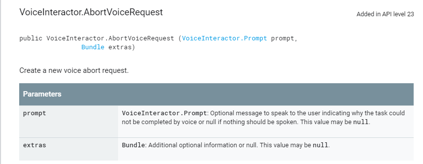

# VoiceInteractor.CommandRequest
## 简介
使用受信任的系统VoiceInteractionService执行特定于供应商的命令。 这样一来，活动就可以向用户请求完成操作所需的其他信息（例如，预订表格可能需要用户选择几次，或者应用可能需要用户同意服务条款）。 确认结果将通过对onCommandResult（boolean，android.os.Bundle）或VoiceInteractor.Request.onCancel（）的异步调用返回。

该命令是描述要执行的一般操作的字符串。 该命令将确定Extras中的属性如何解释，以及可用命令的集合会随着时间的增长而增长。 例如，“ com.google.voice.commands.REQUEST_NUMBER_BAGS”可以请求行李数量作为航空公司登机手续的一部分。 （这不是实际的工作示例。）

## Summary
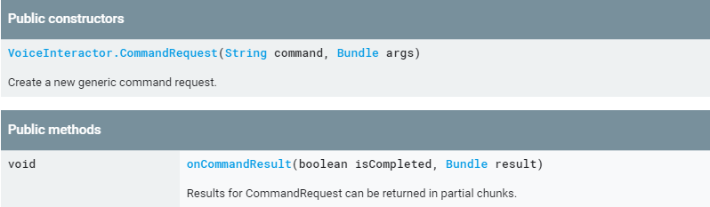
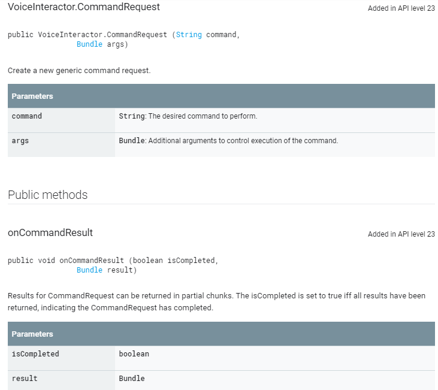

# VoiceInteractor.ConfirmationRequest
## 简介
通过受信任的系统VoiceInteractionService与用户确认操作。 这样，活动就可以完成一项不安全的操作，当未启用语音交互模式时，该操作将要求用户触摸屏幕。 确认的结果将通过对onConfirmationResult（boolean，android.os.Bundle）或VoiceInteractor.Request.onCancel（）的异步调用返回-应重写这些方法以定义应用程序特定的行为。

在某些情况下，这可能是简单的是/否确认，或者确认中可能包含有关如何完成操作的上下文信息（例如，预订出租车可能包括有关出租车到达多久的详细信息），以便用户可以进行确认。

## summary
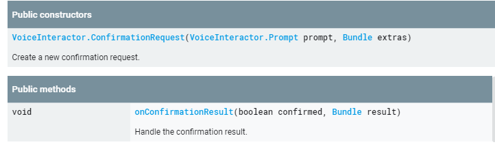

# VoiceInteractor.CompleteVoiceRequest
## 简介
报告当前交互已通过语音成功完成，因此应用程序可以将最终状态报告给用户。 当响应返回时，语音系统已经处理了请求并准备切换。 此时，应用程序可以开始新的非语音活动或完成。 确保在启动新活动时使用Intent.FLAG_ACTIVITY_NEW_TASK将新活动排除在当前语音交互任务之外。

## summary
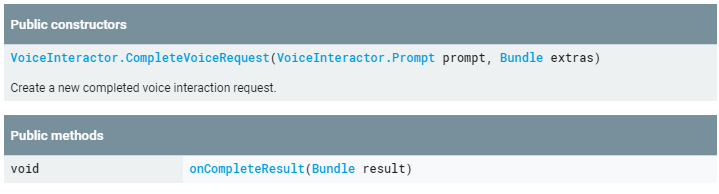

# VoiceInteractor.PickOptionRequest
## 简介
通过受信任的系统VoiceInteractionService与用户从多个潜在选项中选择一个选项。 通常，应用程序会将其直观地显示为列表视图，以允许通过触摸选择选项。 确认的结果将通过对onPickOptionResult（boolean，VoiceInteractor.PickOptionRequest.Option []，Bundle）或VoiceInteractor.Request.onCancel（）的异步调用返回-应该重写这些方法以定义应用程序特定的行为。

## summary
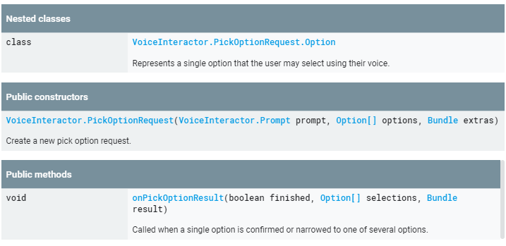

# VoiceInteractor.Prompt
## 简介
一组语音提示，可与语音交互系统一起使用以确认操作，选择选项或执行类似操作。 可以提供多种语音提示以供选择。 必须提供视觉提示，该提示可能与语音版本不匹配。 例如，确认“您确定要购买此商品吗？” 可能会使用“购买项目”之类的视觉标签。

## summary
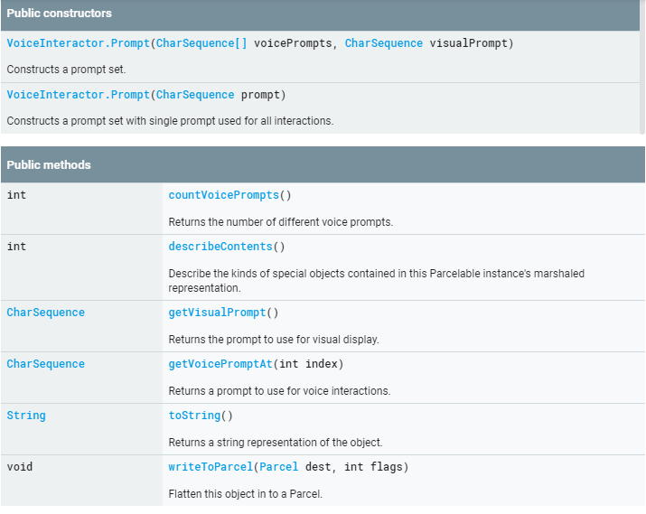

# VoiceInteractor.Request
## 简介
可以提交给交互器的语音交互请求的基类。 不要直接实例化它，而是使用适当的子类。

## summary
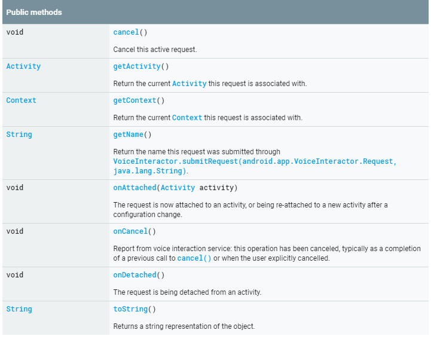

#  链接
[android developer](https://developer.android.com/reference/android/app/VoiceInteractor)