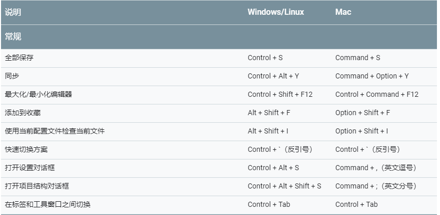
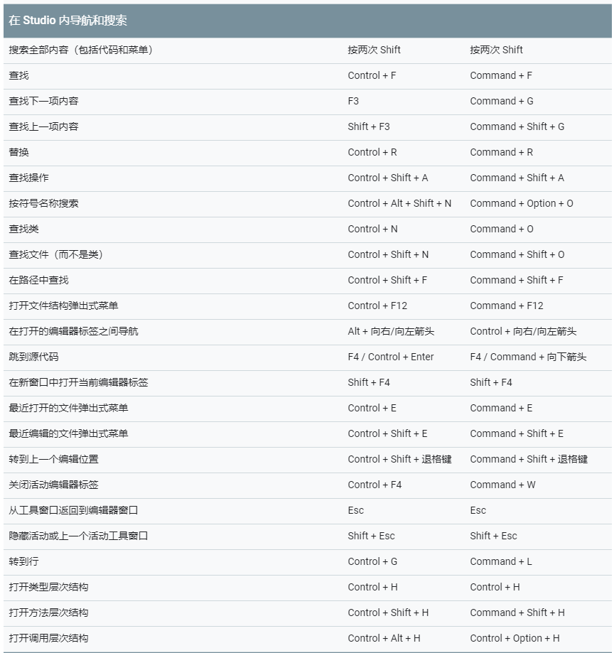
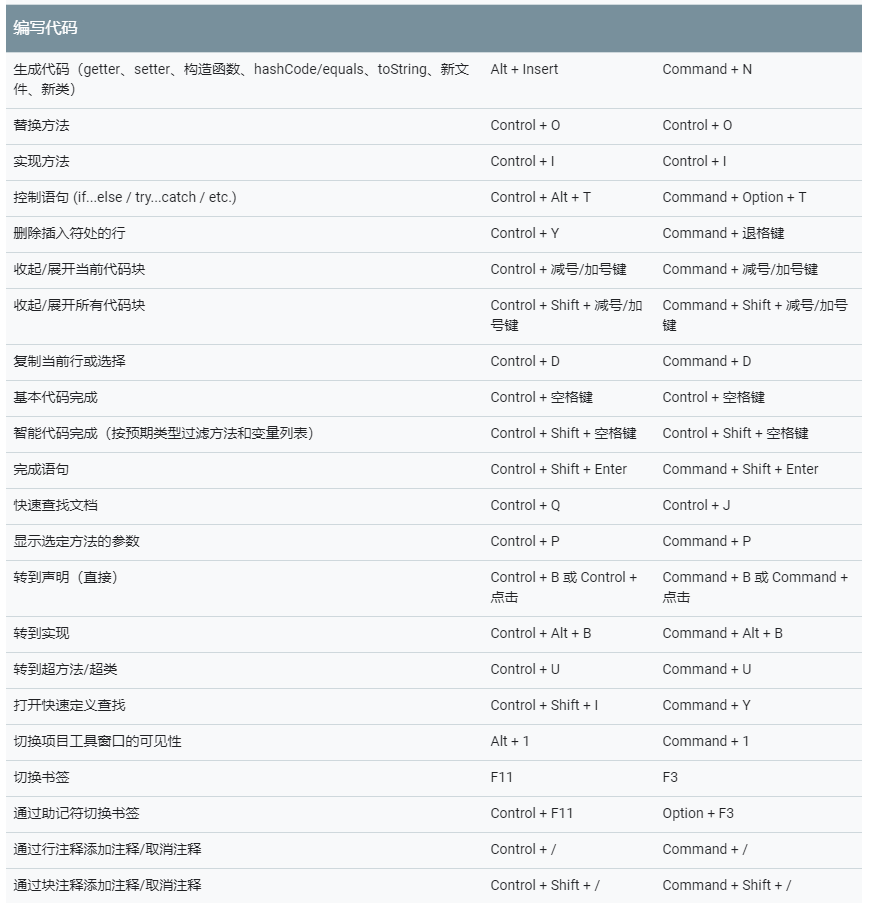
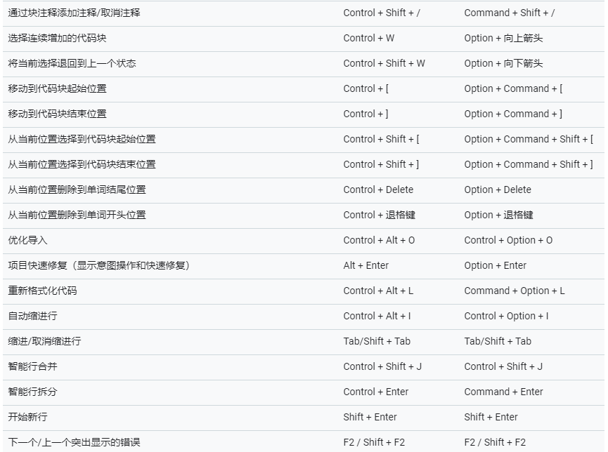
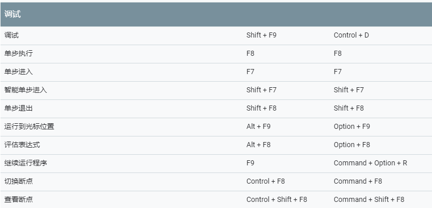
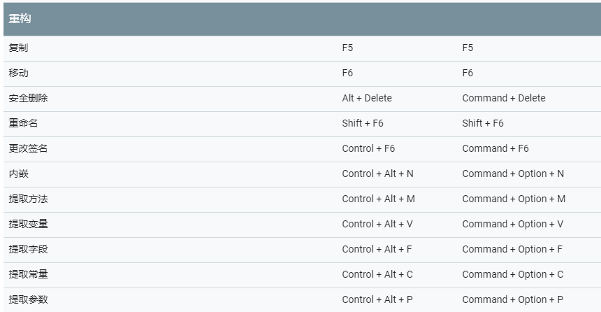
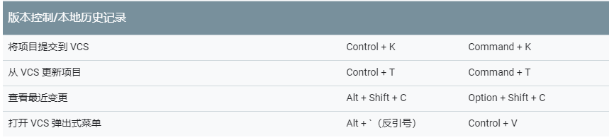

# 快捷键

# Gradle
[Gradle基础](https://segmentfault.com/a/1190000002439306)
[写给 Android 开发者的 Gradle 系列（一）基本姿势](https://juejin.im/post/5af4f117f265da0b9f405221)
[关于Android Gradle你需要指导的](https://juejin.im/post/5a634ddff265da3e3c6c3dbe)

参考：
[Android developer](https://developer.android.com/studio/intro)