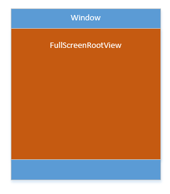
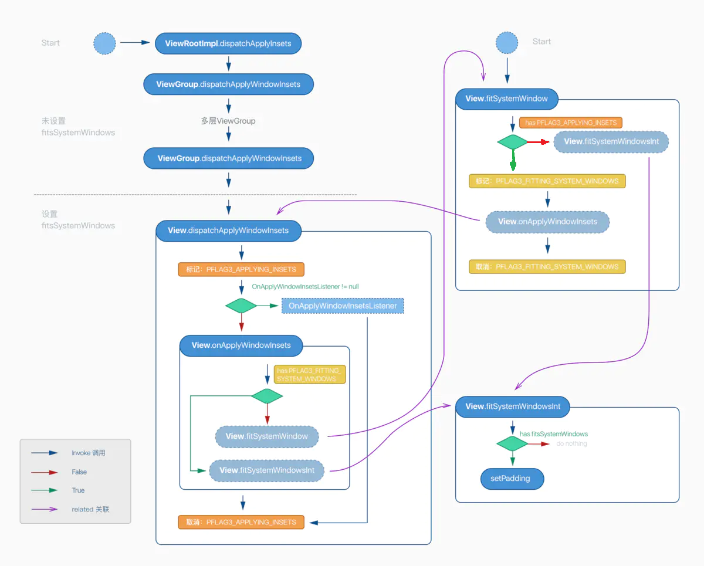

# 背景
Android R中做了许多变更，导致全屏页面的界面显示存在诸多异常，需要针对Android R版本进行重新适配。
	 
# 问题场景
  全屏业务复杂，场景众多，出问题的场景也多：
1、正常出卡界面
2、背景展示（古诗词、天气）（***==重点==***）
3、图片预览
4、编辑模式
5、浮窗直接跳转全屏（尤其是背景与编辑模式）
	 
# 问题原因
   android:fitsSystemWindows="true"为根布局增加了padding，而Android R 使padding为0的方式：LayoutParams.FLAG_LAYOUT_NO_LIMITS失效了，导致界面显示异常。


# 解决方法
  尝试1：
既然需要padding为0，代码设置fitsSystemWindows="false"是不是就可以？实际操作发现，代码设置后仅作用很短一段时间就被置回来，因为采用的Theme（vivoStyle）中也采用了android:fitsSystemWindows="true"，在某些时刻（后面分析）作用了。
	 
尝试2：
	 从业务场景出发，从业务场景进行适配。在不需要padding的地方，手动将rootView的padding置为0。
	 但是背景显示模式需要做动画，通过一个RootView内的一个match_parent的ImageView来实现，动画开始和完成时，都需要更改padding防止异常。
	 此种方法能够解决问题，但是很不友好，需要各个场景都手动适配，任务重风险大。
	 
尝试3：
	 fitsSystemWindows是如何作用的？是否可以从其作用流程更改？
	 
# fitsSystemWindows作用
 官方文档 Hide the status bar | Android Developers 中提到：

Android 4.1 开始，可以将 app 的内容绘制在状态栏的下一层 (behind the status bar)，并且 app 的内容区域的大小不会随着状态栏的出现和消失而自动。使用 SYSTEM_UI_FLAG_LAYOUT_FULLSCREEN 即可实现这种效果。
将 app 的内容绘制在状态栏的下一层时，app 自己负责保证 UI 中的重要内容不被状态栏遮挡(例如，地图应用中的控件不应被状态档遮挡)。否则可能导致应用不可用。大部分时候通过在 XML 文件中添加 android:fitsSystemWindows=true 可以解决这个被遮挡导致不可用的问题。这个属性用于告知父节点要为 system windows 保留一些 padding。

# 如何作用的？
首先找到 View 类的 setFitsSystemWindows 方法：

```javascript
    /**
     * Sets whether or not this view should account for system screen decorations
     * such as the status bar and inset its content; that is, controlling whether
     * the default implementation of {@link #fitSystemWindows(Rect)} will be
     * executed.  See that method for more details.
     *
     * <p>Note that if you are providing your own implementation of
     * {@link #fitSystemWindows(Rect)}, then there is no need to set this
     * flag to true -- your implementation will be overriding the default
     * implementation that checks this flag.
     *
     * @param fitSystemWindows If true, then the default implementation of
     * {@link #fitSystemWindows(Rect)} will be executed.
     *
     * @attr ref android.R.styleable#View_fitsSystemWindows
     * @see #getFitsSystemWindows()
     * @see #fitSystemWindows(Rect)
     * @see #setSystemUiVisibility(int)
     */ 
      public void setFitsSystemWindows(boolean fitSystemWindows) {
        setFlags(fitSystemWindows ? FITS_SYSTEM_WINDOWS : 0, FITS_SYSTEM_WINDOWS);
    }
```
如果设置了android:fitsSystemWindows="true"，则采用默认的
fitSystemWindows(Rect)方法。可以覆写itSystemWindows(Rect)以覆盖默认实现。

``` javascript
    protected boolean fitSystemWindows(Rect insets) {
        if ((mPrivateFlags3 & PFLAG3_APPLYING_INSETS) == 0) {
            if (insets == null) {
                // Null insets by definition have already been consumed.
                // This call cannot apply insets since there are none to apply,
                // so return false.
                return false;
            }
            // If we're not in the process of dispatching the newer apply insets call,
            // that means we're not in the compatibility path. Dispatch into the newer
            // apply insets path and take things from there.
            try {
                mPrivateFlags3 |= PFLAG3_FITTING_SYSTEM_WINDOWS;
                return dispatchApplyWindowInsets(new WindowInsets(insets)).isConsumed();
            } finally {
                mPrivateFlags3 &= ~PFLAG3_FITTING_SYSTEM_WINDOWS;
            }
        } else {
            // We're being called from the newer apply insets path.
            // Perform the standard fallback behavior.
            return fitSystemWindowsInt(insets);
        }
    }
```

主要方法：

``` javascript
private boolean fitSystemWindowsInt(Rect insets) {
        if ((mViewFlags & FITS_SYSTEM_WINDOWS) == FITS_SYSTEM_WINDOWS) {
            Rect localInsets = sThreadLocal.get();
            boolean res = computeFitSystemWindows(insets, localInsets);
            applyInsets(localInsets);
            return res;
        }
        return false;
    }
	
    private void applyInsets(Rect insets) {
        mUserPaddingStart = UNDEFINED_PADDING;
        mUserPaddingEnd = UNDEFINED_PADDING;
        mUserPaddingLeftInitial = insets.left;
        mUserPaddingRightInitial = insets.right;
        internalSetPadding(insets.left, insets.top, insets.right, insets.bottom);
    }
```
可以看到，这里如果设置了属性，就会有一个padding 的设置，问题原因就找到了。但是这个padding 哪里来？什么时候设置的？目前不得而知。

但很明显，我们对FulScreenRootView重写fitSystemWindowsInt方法，就可以对padding相应修改。前文的Android R全屏适配就可以完结了。

So, The End?

...
...
...
重写的时候会发现，该方法被丢弃了，而且上文还有好多疑问没有解决，本着精益求精、寻根究底的太污，我们继续探究下去。
并完成如下问题的解惑：
1、此方法中的padding哪里来？什么时候调用此方法的？
2、此方法被丢弃，那采用什么新方法？


# 调用逻辑
我们可以通过 IDE 中强大的 Find Usages 来反向推导一下。最后发现它是由一个名为 dispatchApplyWindowInsets 的方法调用的，而且通过参数传了一个 WindowInsets 对象（==这是啥？==）


``` javascript
public void dispatchApplyInsets(View host) {
        Trace.traceBegin(Trace.TRACE_TAG_VIEW, "dispatchApplyInsets");
        mApplyInsetsRequested = false;
        WindowInsets insets = getWindowInsets(true /* forceConstruct */);
        if (!shouldDispatchCutout()) {
            // Window is either not laid out in cutout or the status bar inset takes care of
            // clearing the cutout, so we don't need to dispatch the cutout to the hierarchy.
            insets = insets.consumeDisplayCutout();
        }
        host.dispatchApplyWindowInsets(insets);
        mAttachInfo.delayNotifyContentCaptureInsetsEvent(insets.getInsets(Type.all()));
        Trace.traceEnd(Trace.TRACE_TAG_VIEW);
    }
```

原来是 ViewRootImpl 发起的，这个类很重要，实现了很多 View
与 WindowManager 的交互，这里 ViewRootImpl 拿到了一个 WindowInsets 对象，这个对象就是包含了一些系统所占用的区域（导航栏、状态栏、输入法等），***==这些区域可以被消耗掉，并且消耗之后返回的是一个全新的对象，这句话请谨记==***。


 # 新方法
看下fitsystemWindows的注释：
``` javascript
/*
* @deprecated As of API 20 use {@link #dispatchApplyWindowInsets(WindowInsets)} to apply
     * insets to views. Views should override {@link #onApplyWindowInsets(WindowInsets)} or use
     * {@link #setOnApplyWindowInsetsListener(android.view.View.OnApplyWindowInsetsListener)}
     * to implement handling their own insets.
     */
```
有两种实现方式：
1、重写View的onApplyWindowInsets(WindowInsets insets)方法
2、对View设置监听setOnApplyWindowInsetsListener(OnApplyWindowInsetsListener listener)

``` javascript
public interface OnApplyWindowInsetsListener {
        /**
         * When {@link View#setOnApplyWindowInsetsListener(View.OnApplyWindowInsetsListener) set}
         * on a View, this listener method will be called instead of the view's own
         * {@link View#onApplyWindowInsets(WindowInsets) onApplyWindowInsets} method.
         *
         * @param v The view applying window insets
         * @param insets The insets to apply
         * @return The insets supplied, minus any insets that were consumed
         */
        public WindowInsets onApplyWindowInsets(View v, WindowInsets insets);
    }
```
接口返回WindowInsets,
（***==这些区域可以被消耗掉，并且消耗之后返回的是一个全新的对象，这句话请谨记==***。）

# 新旧方法的调用逻辑



# WindowInsets


# 最终的解决方法

``` javascript
mRootView.setOnApplyWindowInsetsListener(new View.OnApplyWindowInsetsListener() {
            @Override
            public WindowInsets onApplyWindowInsets(View v, WindowInsets insets) {
                insets.replaceSystemWindowInsets(0,0,0,0);
                return insets;
            }
        });
```