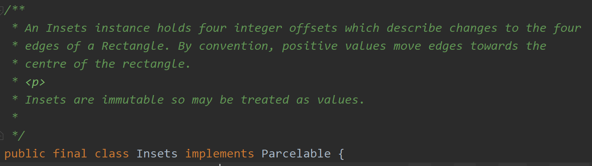

[WindowInsets 在View下的的分发（一）](https://www.jianshu.com/p/756e94fa2e09)

[WindowInsets 在View下的的分发（二）](https://www.jianshu.com/p/986e2f8c98ff)

# 什么是WindowInsets
Android 源码中的描述：

``` javascript
 Describes a set of insets for window content.

WindowInsets are immutable and may be expanded to include more inset types in the future.
To adjust insets, use one of the supplied clone methods to obtain a new WindowInsets instance with the adjusted properties.
```
翻译一下：
描述窗口内容的一组集合。

WindowInsets是不可变的，将来可能会扩展为包括更多的inset类型。
**若要调整Insets，请使用提供的克隆方法之一获取具有已调整属性的新WindowInsets实例。**

其主要成员包括 mSystemWindowInsets， mWindowDecorInsets， mStableInsets。

mSystemWindowInsets
表示全窗口下，被StatusBar, NavigationBar, IME 或者其它系统窗口部分或者全部覆盖的区域。

mWindowDecorInsets
表示内容窗口下，被Android FrameWork提供的窗体，诸如ActionBar, TitleBar, ToolBar，部分或全部覆盖区域。

mStableInsets
表示全窗口下，被系统UI部分或者全部覆盖的区域。

以 mSystemWindowInsets 为例，获取Insets以及四个边距的方法：

``` javascript
public Insets getSystemWindowInsets() {
        Insets result = mCompatIgnoreVisibility
                ? getInsetsIgnoringVisibility(mCompatInsetsTypes & ~ime())
                : getInsets(mCompatInsetsTypes);

        // We can't query max insets for IME, so we need to add it manually after.
        if ((mCompatInsetsTypes & ime()) != 0 && mCompatIgnoreVisibility) {
            result = Insets.max(result, getInsets(ime()));
        }
        return result;
    }
	
	public int getSystemWindowInsetLeft() {
    return getSystemWindowInsets().left;
}

public int getSystemWindowInsetTop() {
    return getSystemWindowInsets().top;
}

public int getSystemWindowInsetRight() {
    return getSystemWindowInsets().right;
}

public int getSystemWindowInsetBottom() {
    return getSystemWindowInsets().bottom;
}
```
它的四个点已经不再表示围成矩形的坐标，而表示的是insets需要的左右的宽度，顶部和底部需要的高度。

（一个Insets实例包含四个整数偏移量，这些偏移量描述了Rectangle四个边缘的变化。 按照惯例，正值会将边移向矩形的中心。）

# 更新（替代）WindowInsets
以 mSystemWindowInsets 为例：
public WindowInsets replaceSystemWindowInsets(int left, int top, int right, int bottom) 

# 谁在消费WindowsInsets
就是之前说的，两种新的实现方式：
有两种实现方式：
1、重写View的onApplyWindowInsets(WindowInsets insets)方法
2、对View设置监听setOnApplyWindowInsetsListener(OnApplyWindowInsetsListener listener)

深入View的源码可以发现，如果View设定了
OnApplyWindowInsetsListener后，会采用OnApplyWindowInsetsListener的实现来处理WindowInsets，否则才会使用onApplyWindowInsets(WindowInsets)方法来处理WindowInsets，在dispatchApplyWindowInsets(WindowInsets)中进行分发处理
